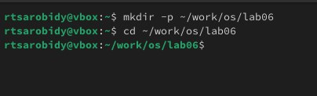
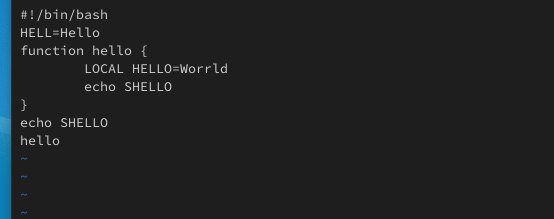
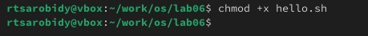
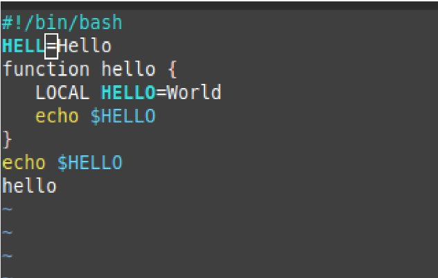
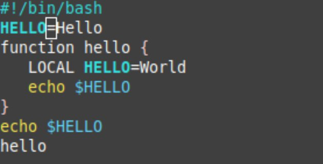
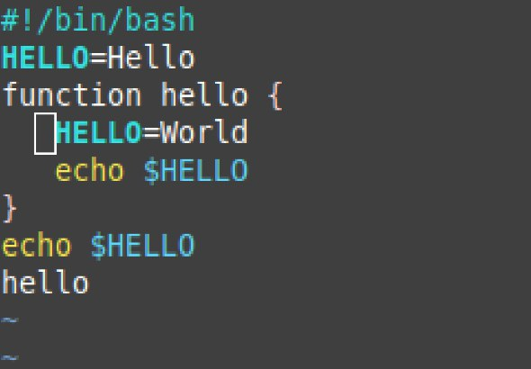
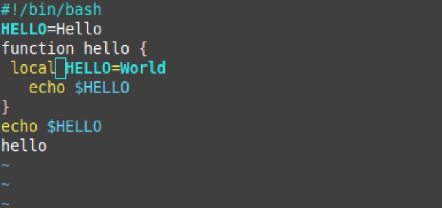
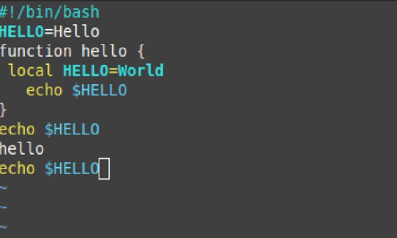
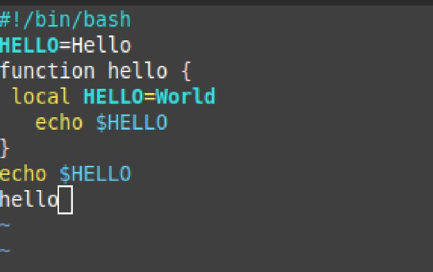
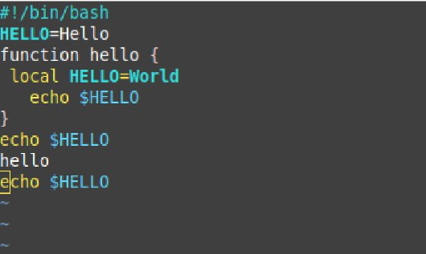

---
## Front matter
title: "Отчёт по Лабораторной работе No10"
subtitle: "Операционные системы"
author: "Ракутуманандзара Цантамписедрана Сарубиди"

## Generic otions
lang: ru-RU
toc-title: "Содержание"

## Bibliography
bibliography: bib/cite.bib
csl: pandoc/csl/gost-r-7-0-5-2008-numeric.csl

## Pdf output format
toc: true # Table of contents
toc-depth: 2
lof: true # List of figures
lot: true # List of tables
fontsize: 12pt
linestretch: 1.5
papersize: a4
documentclass: scrreprt
## I18n polyglossia
polyglossia-lang:
  name: russian
  options:
	- spelling=modern
	- babelshorthands=true
polyglossia-otherlangs:
  name: english
## I18n babel
babel-lang: russian
babel-otherlangs: english
## Fonts
mainfont: PT Serif
romanfont: PT Serif
sansfont: PT Sans
monofont: PT Mono
mainfontoptions: Ligatures=TeX
romanfontoptions: Ligatures=TeX
sansfontoptions: Ligatures=TeX,Scale=MatchLowercase
monofontoptions: Scale=MatchLowercase,Scale=0.9
## Biblatex
biblatex: true
biblio-style: "gost-numeric"
biblatexoptions:
  - parentracker=true
  - backend=biber
  - hyperref=auto
  - language=auto
  - autolang=other*
  - citestyle=gost-numeric
## Pandoc-crossref LaTeX customization
figureTitle: "Рис."
tableTitle: "Таблица"
listingTitle: "Листинг"
lofTitle: "Список иллюстраций"
lotTitle: "Список таблиц"
lolTitle: "Листинги"
## Misc options
indent: true
header-includes:
  - \usepackage{indentfirst}
  - \usepackage{float} # keep figures where there are in the text
  - \floatplacement{figure}{H} # keep figures where there are in the text
---

# Цель работы

Познакомиться с операционной системой Linux. Получить практические навыки работы с редактором vi, установленным по умолчанию практически во всех дистрибутивах.

# Задание

1. Создание нового файла с использованием vi

2. Редактирование существующего файла

3. Контрольные вопросы

# Выполнение лабораторной работы

**1. Создание нового файла с использованием vi**

Я создайте каталог с именем ~/work/os/lab06 и перехожу в только созданный каталог(рис.1)

{#fig:001 width=70%}

Я зову vi и создаю файл hello.sh. После этого я нажмаю клавишу i и вводите текст(рис.2)

{#fig:001 width=70%}

Я нажмаю клавишу Esc для перехода в командный режим после завершения ввода текста,":" для перехода в режим последней строки и внизу вашего экрана появится приглашение в виде двоеточия и w (записать) и q (выйти), а затем нажмаю клавишу Enter для сохранения текста и завершения работы.(рис.3)

{#fig:001 width=70%}

Я меняю права доступа к файлу hello.sh, добавляя права выполнение у владельца(рис.4)

{#fig:001 width=70%}

**2. Редактирование существующего файла**

Я зову vi на редактирование файл(рис.5)

{#fig:001 width=70%}

Я установливаю курсор в конец слова HELL второй строки(рис.6)

{#fig:001 width=70%}

Перехожу в режим вставки и замените на HELLO.Я нажмаю Esc для возврата в командный режим(рис.7)

{#fig:001 width=70%}

Я установливаю курсор на четвертую строку и сотрите слово LOCAL(рис.8)

{#fig:001 width=70%}

Я перехожу в режим вставки и наберите текст: local, после того нажмаю Esc для возврата в командный режим(рис.9)

{#fig:001 width=70%}

Я установливаю курсор на последней строке файла. Вставьте после неё строку, содержащую текст: echo $HELLO.После того нажмите Esc для перехода в командный режим(рис.10)

{#fig:001 width=70%}

Я удаляю последнюю строку с помощью 'd' 'w'(рис.11)

{#fig:001 width=70%}

Я введу команду отмены изменений "u" для отмены последней команды(рис.12)

{#fig:001 width=70%}

Я введу символ ':' для перехода в режим последней строки. Записываю произведённые изменения и выйдите из vi(рис.13)

{#fig:001 width=70%}

**3. Контрольные вопросы**

1. командный режим — предназначен для ввода команд редактирования и навигации по редактируемому файлу;

• режим вставки — предназначен для ввода содержания редактируемого файла;

• режим последней (или командной) строки — используется для записи изменений в файл и выхода из редактора.

2. Можно нажимать символ q (или q!), если требуется выйти из редактора без сохранения.

3. • 0 (ноль) — переход в начало строки;

• $ — переход в конец строки;

• G — переход в конец файла;

• n G — переход на строку с номером n.

4. Редактор vi предполагает, что слово - это строка символов, которая может включать в себя буквы, цифры и символы подчеркивания.

5. С помощью G — переход в конец файла

6. • Вставка текста – а — вставить текст после курсора; – А — вставить текст в конец строки; – i — вставить текст перед курсором; – n i — вставить текст n раз; – I  вставить текст в начало строки.

• Вставка строки – о — вставить строку под курсором; – О — вставить строку над курсором.

• Удаление текста – x — удалить один символ в буфер; – d w — удалить одно слово в буфер; – d $ — удалить в буфер текст от курсора до конца строки; – d 0 — удалить в буфер текст от начала строки до позиции курсора; – d d — удалить в буфер одну строку; – n d d — удалить в буфер n строк.

• Отмена и повтор произведённых изменений – u — отменить последнее изменение; – . — повторить последнее изменение.

• Копирование текста в буфер – Y — скопировать строку в буфер; – n Y — скопировать n строк в буфер; – y w — скопировать слово в буфер.

• Вставка текста из буфера – p — вставить текст из буфера после курсора; – P — вставить текст из буфера перед курсором.

• Замена текста – c w — заменить слово; – n c w — заменить n слов; – c $ — заменить текст от курсора до конца строки; – r — заменить слово; – R — заменить текст.

• Поиск текста – / текст — произвести поиск вперёд по тексту указанной строки символов текст; – ? текст — произвести поиск назад по тексту указанной строки символов текст.

7. Перейти в режим вставки.

8. С помощью u — отменить последнее изменение

9. Режим последней строки — используется для записи изменений в файл и выхода из редактора.

10. $ — переход в конец строки

11. Опции редактора vi позволяют настроить рабочую среду. Для задания опций используется команда set (в режиме последней строки): – : set all — вывести полный список опций; – : set nu — вывести номера строк; – : set list — вывести невидимые символы; – : set ic — не учитывать при поиске, является ли символ прописным или строчным.

12. В редакторе vi есть два основных режима: командный режим и режим вставки. По умолчанию работа начинается в командном режиме. В режиме вставки клавиатура используется для набора текста. Для выхода в командный режим используется клавиша Esc или комбинация Ctrl + c.

# Выводы

Выполняя эту лабараторную работу познакомилася с операционной системой Linux. Получила практические навыки работы с редактором vi, установленным по умолчанию практически во всех дистрибутивах.

# Список литературы{.unnumbered}

Лабораторная работа № 8. Текстовой редактор vi
