---
## Front matter
lang: ru-RU
title: Презентация по лабораторной работе No11
subtitle: Операционные системы
author:
  - Цантамписедрана С.
institute:
  - Российский университет дружбы народов, Москва, Россия
date: 26 Апреля 2025

## i18n babel
babel-lang: russian
babel-otherlangs: english

## Formatting pdf
toc: false
toc-title: Содержание
slide_level: 2
aspectratio: 169
section-titles: true
theme: metropolis
header-includes:
 - \metroset{progressbar=frametitle,sectionpage=progressbar,numbering=fraction}
 - '\makeatletter'
 - '\beamer@ignorenonframefalse'
 - '\makeatother'
---

## Цель работы

Познакомиться с операционной системой Linux. Получить практические навыки работы с редактором Emacs

## Задание

1. Основные команды emacs

2. Научиться использовать команды по перемещению курсора.

3. Управление буферами

4. Управление окнами.

5. Режим поиска

## 1. Основные команды emacs

Я открываю emacs и создаю файл lab07.sh с помощью комбинации Ctrl-x Ctrl-f (C-x C-f)(рис.1). Emacs представляет собой мощный экранный редактор текста, написанный на языке высокого уровня Elisp.

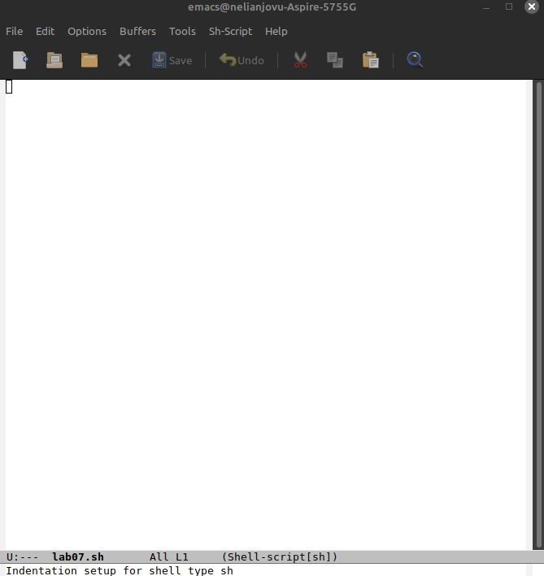{#fig:001 width=70%}

## 1. Основные команды emacs

Я записываю текст в только созданный файл. Потом я сохраняю файл с помощью комбинации Ctrl-x Ctrl-s (C-x C-s)(рис.2)

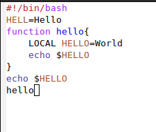{#fig:002 width=70%}

## 1. Основные команды emacs

Я вырезаю одной командой целую строку(С-k)(рис.3)

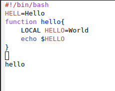{#fig:003 width=70%}

## 1. Основные команды emacs

Я вставлю эту строку в конец файла с помощью С-у(рис.4)

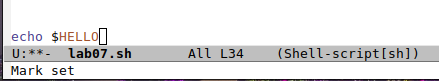{#fig:004 width=70%}

## 1. Основные команды emacs

Я выделяю область текста с помощью С-space(рис.5)

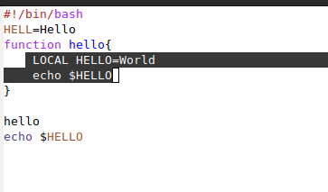{#fig:005 width=70%}

## 1. Основные команды emacs

Я скопирую область в буфер обмена (M-w) и вставливаю область в конец файла(рис.6). Буфер — объект, представляющий какой-либо текст.Область вывода — одна или несколько строк внизу фрейма, в которой Emacs выводит различные сообщения, а также запрашивает подтверждения и дополнительную информацию от пользователя.

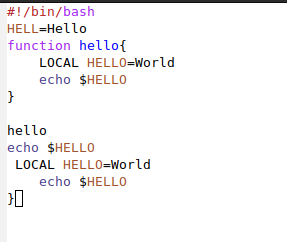{#fig:006 width=70%}

## 1. Основные команды emacs

Я ещё раз выделяю эту область и на этот раз вырезаю её(С-w)(рис.7)

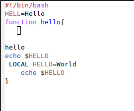{#fig:007 width=70%}

## 1. Основные команды emacs

Потом я отменяю последнее действие(рис.8)

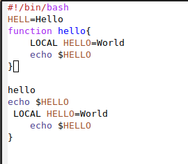{#fig:008 width=70%}

## 2. Научиться использовать команды по перемещению курсора.

Сначала я перемещаю курсор в начало строки с помощью С-а(рис.9)

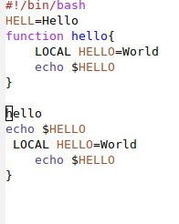{#fig:009 width=70%}

## 2. Научиться использовать команды по перемещению курсора.

После этого я перемещаю курсор в конец строки(С-е)(рис.10)

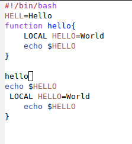{#fig:010 width=70%}

## 2. Научиться использовать команды по перемещению курсора.

Затем я перемещаю курсор в начало буфера с помощью M(alt)-<(рис.11)

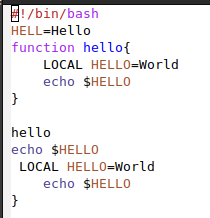{#fig:011 width=70%}

## 2. Научиться использовать команды по перемещению курсора.

Потом я перемещаю курсор в конец буфера(M->)(рис.12)

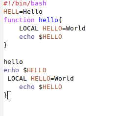{#fig:012 width=70%}

## 3. Управление буферами

Я выведу список активных буферов на экран (C-x C-b)(рис.13)

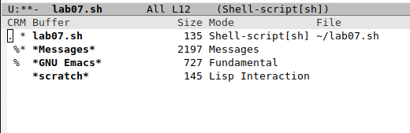{#fig:013 width=70%}

## 3. Управление буферами

Я перемещаю во вновь открытое окно "(C-x) o" со списком открытых буферов и переключаюсь на другой буфер(рис.14). Окно — прямоугольная область фрейма, отображающая один из буферов.

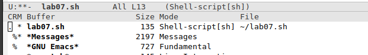{#fig:014 width=70%}

## 3. Управление буферами

После этого я закрываю это окно (C-x 0)(рис.15)

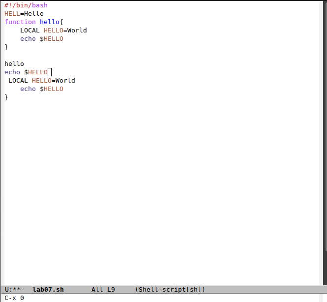{#fig:015 width=70%}

## 3. Управление буферами

Открываю другой буфер без вывода их списка на экран с помощью C-x b(рис.16)

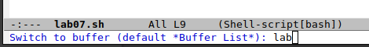{#fig:016 width=70%}

## 4. Управление окнами.

Я поделяю фрейм на 4 части: разделяю фрейм на два окна по вертикали (C-x 3), а затем каждое из этих окон на две части по горизонтали (C-x 2)(рис.17).Фрейм соответствует окну в обычном понимании этого слова. Каждый фрейм содержит область вывода и одно или несколько окон Emacs

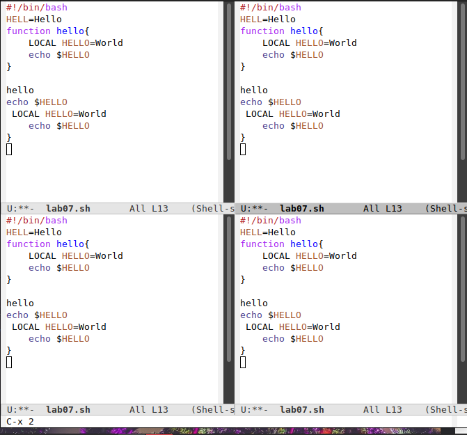{#fig:017 width=70%}

## 4. Управление окнами.

В каждом из четырёх созданных окон, я открываю новый буфер (файл) и введу несколько строк текста(рис.18)

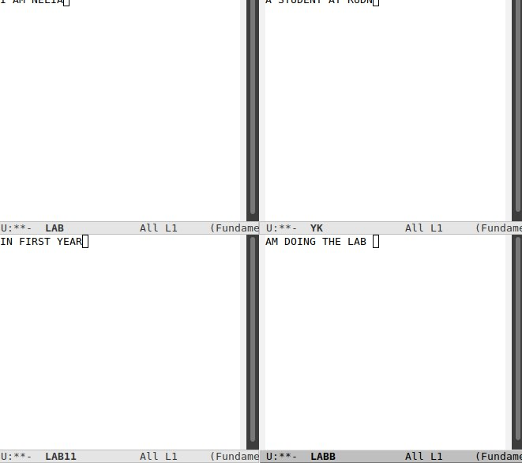{#fig:018 width=70%}
 
## 5. Режим поиска

Я переключаюсь в режим поиска (C-s) и наиду несколько слов, присутствующих в тексте(рис.19)

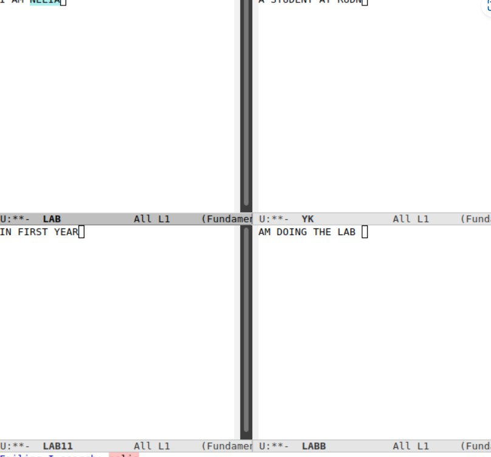{#fig:019 width=70%}

## 5. Режим поиска

Я выхожу из режима поиска, нажав C-g(рис.20)

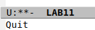{#fig:020 width=70%}

## 5. Режим поиска

Перехожу в режим поиска и замены с помощью M-%, ввожу какое слово хочу заменить, затем ввожу на какое хочу заменить(рис.21)

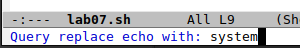{#fig:021 width=70%}

## 5. Режим поиска

С помощью M-s о перехожу в другой режим поиска. Он отличается от предыдущего тем, что выводит результат в отдельном окне от окна буфера и даёт полную строку где слова содержить(рис.22)

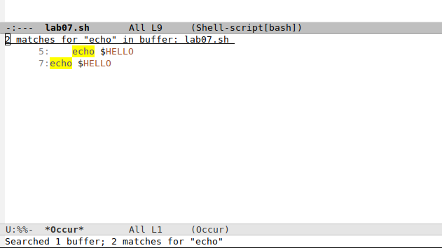{#fig:001 width=70%}

## Выводы

Выполняя эту лабораторную работу познакомилася с операционной системой Linux и получила практические навыки работы с редактором Emacs

