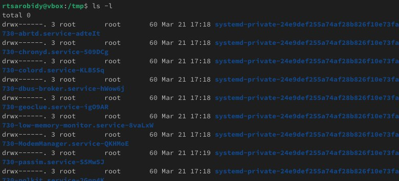

---
## Front matter
title: "Лабораторная работа No6"
subtitle: "Операционные системы"
author: "Ракутуманандзара Цантамписедрана Сарубиди"

## Generic otions
lang: ru-RU
toc-title: "Содержание"

## Bibliography
bibliography: bib/cite.bib
csl: pandoc/csl/gost-r-7-0-5-2008-numeric.csl

## Pdf output format
toc: true # Table of contents
toc-depth: 2
lof: true # List of figures
lot: true # List of tables
fontsize: 12pt
linestretch: 1.5
papersize: a4
documentclass: scrreprt
## I18n polyglossia
polyglossia-lang:
  name: russian
  options:
	- spelling=modern
	- babelshorthands=true
polyglossia-otherlangs:
  name: english
## I18n babel
babel-lang: russian
babel-otherlangs: english
## Fonts
mainfont: PT Serif
romanfont: PT Serif
sansfont: PT Sans
monofont: PT Mono
mainfontoptions: Ligatures=TeX
romanfontoptions: Ligatures=TeX
sansfontoptions: Ligatures=TeX,Scale=MatchLowercase
monofontoptions: Scale=MatchLowercase,Scale=0.9
## Biblatex
biblatex: true
biblio-style: "gost-numeric"
biblatexoptions:
  - parentracker=true
  - backend=biber
  - hyperref=auto
  - language=auto
  - autolang=other*
  - citestyle=gost-numeric
## Pandoc-crossref LaTeX customization
figureTitle: "Рис."
tableTitle: "Таблица"
listingTitle: "Листинг"
lofTitle: "Список иллюстраций"
lotTitle: "Список таблиц"
lolTitle: "Листинги"
## Misc options
indent: true
header-includes:
  - \usepackage{indentfirst}
  - \usepackage{float} # keep figures where there are in the text
  - \floatplacement{figure}{H} # keep figures where there are in the text
---

# Цель работы

Приобретение практических навыков взаимодействия пользователя с системой посредством командной строки.

# Задание

1. Определите полное имя вашего домашнего каталога.

2. Выполните следующие действия:

 - Перейдите в каталог /tmp.

 - Выведите на экран содержимое каталога /tmp.

 - Определите, есть ли в каталоге /var/spool подкаталог с именем cron?

 - Перейдите в Ваш домашний каталог и выведите на экран его содержимое.

3. Выполните следующие действия:

 - В домашнем каталоге создайте новый каталог с именем newdir.

 - В каталоге ~/newdir создайте новый каталог с именем morefun.

 - В домашнем каталоге создайте одной командой три новых каталога с именами letters, memos, misk. Затем удалите эти каталоги одной командой.

 - Попробуйте удалить ранее созданный каталог ~/newdir командой rm. Проверьте, был ли каталог удалён.

 - Удалите каталог ~/newdir/morefun из домашнего каталога. Проверьте, был ли каталог удалён.

4. С помощью команды man определите, какую опцию команды ls нужно использовать для просмотра содержимое не только указанного каталога, но и подкаталогов, входящих в него.

5. С помощью команды man определите набор опций команды ls, позволяющий отсортировать по времени последнего изменения выводимый список содержимого каталога с развёрнутым описанием файлов.

6. Используйте команду man для просмотра описания следующих команд: cd, pwd, mkdir, rmdir, rm. Поясните основные опции этих команд.

7. Используя информацию, полученную при помощи команды history, выполните модификацию и исполнение нескольких команд из буфера команд

# Выполнение лабораторной работы

Я определяю полное имя домашнего каталога с помощью команду pwd(рис.1)

{#fig:001 width=70%}

Я перехожу в каталог tmp использование команда cd(рис.2)

{#fig:001 width=70%}

Я просматриваю содержимое каталога tmp с помощью команду ls без ключа(рис.3)

{#fig:001 width=70%}

Теперь просматриваю содержимое каталога tmp с помощью комманду ls с разными опциями. Опция -l показывает допольнительну информацию о файлах в каталоге(время создания, владельца, права)(рис.4)

{#fig:001 width=70%}

Опция -а показывает скрытие файлы в каталоге(рис.5)

{#fig:001 width=70%}

Я перехожу в каталоге /var/spool, чтобы определить, есть ли в каталоге подкаталог с соответсвующим именем, я использую команду ls с флагом -F. Опция F показывается все подкаталоги в каталоге, в котором вы находитесь(рис.6)

{#fig:001 width=70%}

Я возвращаюсь в домашний каталог, запустив cd и проверяю содержимое каталога с помощью команду ls c опции -аlF(рис.7)

{#fig:001 width=70%}

Я создаю новый каталог newdir с помощью команду mkdir, перехожу в только созданую каталог и создать ещё новый каталог под названием morefun(рис.8)

{#fig:001 width=70%}

Я создаю несколько каталоги с одном командом. Чтобы делать это с одной строчкой нужно перечислить названия каталога через пробел после команду mkdir. После этого проверяю если каталоги созданы(рис.9)

{#fig:001 width=70%}

Я удаляю несколько каталоги с одном командом.Чтобы делать это с одной строчкой нужно перечислить названия каталога через пробел после команду rm с флагом -r. После этого проверяю если каталоги удалёны(рис.10)

{#fig:001 width=70%}

Я попробовала удалить ~/newdir с командой rm но не получилась потому что rm удаляет файлы, чтобы она удаляет не пустый каталог нужно добавить опции для рекурсивного удаления -r(рис.11)

{#fig:001 width=70%}

Я удаляю каталог newdir с помощью команду rm с флагом -r, потом проверяю если удаляется(рис.12)

{#fig:001 width=70%}

С помощью команды man я определяю, какую опцию команды ls нужно использовать для просмотра содержимое не только указанного каталога, но и подкаталогов,входящих в него(рис.13)

{#fig:001 width=70%}

С помощью команды man тоже определяю набор опций команды ls, позволяющий отсортировать по времени последнего изменения выводимый список содержимого каталога с развёрнутым описанием файлов(рис.14)

{#fig:001 width=70%}

Я использую команду man для просмотра описания следующих команд:

1. cd: -p - позволяет следовать по символически ссылки перед тем, как обработаны все переходы. -L - переходит по символическим ссылкам только после того, как обработаны все переходы. -e - позволяет выйти с ошибкой, если директория, в которую нужно перейти не найдена(рис.15)

{#fig:001 width=70%}

2. pwd: -L - брать директорию из переменной окружения, даже если она содержит символические ссылки. -P - отбрасывать все символические ссылки(рис.16)

{#fig:001 width=70%}

3. mkdir: -m - устанавливает права доступа создаваемой директории как chmod, синтаксис тоже как у chmod. -p - позволяет рекурсивно создавать директории и их подкаталоги. -v - выводи сообщение о созданных директориях. -z - установить контекст SELinux для создаваемой директории по умолчанию. -context - установить контекст SELinux для создаваемой директории в значении CTX(рис.17)

{#fig:001 width=70%}

4. rmdir: -ignore-fail-on-non-empty - отменяет вывод ошибки, если каталог не пустой, просто его игнорирует. -р - удаляет рекурсивно каталог, если они все содержат в себе только удаляемый каталог. -v - выводить сообщение о каждом удалении директории(рис.18)

{#fig:001 width=70%}
  
5. rm: -f - игнорировать несуществующие файлы или аргументы, никогда не выводить запрос на подтверждение удаление. -i - выводить запрос на подтверждение удаления каждого файла. -l - вывести запрос на подтверждение удаления один раз, для всех файлов, если удаляется больше 3-х файлов или идет рекурсивное удаление. -interactive - заменяет предыдущие три опции, можно выбрать одну из них. -one-file-system - во время рекурсивного удаления пропускать директории из других файловых систем. -no-preserve-root - если в качестве дироктории задана корневая, то считать что это обычная директория и начать удаление. -r или -R - удаляет директории их содержимое рекурсивно. -d или -dir - удаляет пустые директории. -v - прописывает все действия команды(рис.19)

{#fig:001 width=70%}

Вывела историю команд с помощь команду history(рис.20)

{#fig:001 width=70%}

Модифицировала команду(рис.21)

{#fig:001 width=70%}

Модифицировала команду(рис.22)

{#fig:001 width=70%}

Модифицировала команду(рис.23)

{#fig:001 width=70%}

# Ответы на онтрольные вопросы

1. Командная строка - это текстовая система, которая передает команды компьютеру и возвращает результаты пользователю. В операционной системе типа Linux взаимодействие пользователя с системой обычно осуществляется с помощью командной строки посредством построчного ввода команд.

2. Для определения абсолютного пути к текущему каталогу используется команда pwd. Например: если я введу pwd в своем домашнем каталоге то получу /home/nelianjovu

3. С помощью команды ls можно определить имена файлов, при помощи опции -F уже мы сможем определить тип файлов, если нам необходимы скрытые файлы, добавим опцию -a. Пример есть в лабораторной работе.

4. С помощью команды ls можно определить имена файлов, если нам необходимы скрытые файлы, добавим опцию -a. Пример есть в лабораторной работе.

5. rmdir по умолчанию удаляет пустые каталоги, не удаляет файлы. rm удаляет файлы, без дополнительных опций (-d, -r) не будет удалять каталоги. Удалить в одной строчке одной командой можно файл и каталог. Если файл находится в каталоге, используем рекурсивное удаление, если файл и каталог не связаны подобным образом, то добавим опцию -d, введя имена через пробел после утилиты.

6. Вывести информацию о последних выполненных пользователем команд можно с помощью history. Пример приведет в лабораторной работе.

7. Используем синтаксиси !номеркоманды в выводе history:s/что заменяем/на что заменяем Примеры приведены в лабораторной работе.

8. Предположим, я нахожусь не в домашнем каталоге. Если я введу “cd ; ls”, то окажусь в домашнем каталоге и получу вывод файлов внутри него.

9. Символ экранирования - (обратный слеш) добавление перед спецсимволом обратный слеш, чтобы использовать специальный символ как обычный. Также позволяет читать системе название директорий с пробелом. Пример:cd work/Операционные системы/

10. Опция -l позволит увидеть дополнительную информацию о файлах в каталоге: время создания, владельца, права доступа

11. Относительный путь к файлу начинается из той директории, где вы находитесь (она сама не прописывается в пути), он прописывается относительно данной директории. Абсолютный путь начинается с корневого каталога.

12. Использовать man или –help

13. Клавиша Ta

# Выводы

Выполняя эту лабораторную работу я Приобрела практических навыков взаимодействия пользователя с системой посредством командной строки.

# Список литературы{.unnumbered}

Лабораторная работа № 6
