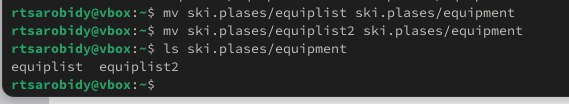
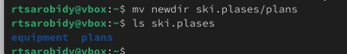

---
## Front matter
title: "Отчет по лабораторной работе No7"
subtitle: "Операционные системы"
author: "Ракутуманандзара Цантамписедрана Сарубиди"

## Generic otions
lang: ru-RU
toc-title: "Содержание"

## Bibliography
bibliography: bib/cite.bib
csl: pandoc/csl/gost-r-7-0-5-2008-numeric.csl

## Pdf output format
toc: true # Table of contents
toc-depth: 2
lof: true # List of figures
lot: true # List of tables
fontsize: 12pt
linestretch: 1.5
papersize: a4
documentclass: scrreprt
## I18n polyglossia
polyglossia-lang:
  name: russian
  options:
	- spelling=modern
	- babelshorthands=true
polyglossia-otherlangs:
  name: english
## I18n babel
babel-lang: russian
babel-otherlangs: english
## Fonts
mainfont: PT Serif
romanfont: PT Serif
sansfont: PT Sans
monofont: PT Mono
mainfontoptions: Ligatures=TeX
romanfontoptions: Ligatures=TeX
sansfontoptions: Ligatures=TeX,Scale=MatchLowercase
monofontoptions: Scale=MatchLowercase,Scale=0.9
## Biblatex
biblatex: true
biblio-style: "gost-numeric"
biblatexoptions:
  - parentracker=true
  - backend=biber
  - hyperref=auto
  - language=auto
  - autolang=other*
  - citestyle=gost-numeric
## Pandoc-crossref LaTeX customization
figureTitle: "Рис."
tableTitle: "Таблица"
listingTitle: "Листинг"
lofTitle: "Список иллюстраций"
lotTitle: "Список таблиц"
lolTitle: "Листинги"
## Misc options
indent: true
header-includes:
  - \usepackage{indentfirst}
  - \usepackage{float} # keep figures where there are in the text
  - \floatplacement{figure}{H} # keep figures where there are in the text
---

# Цель работы

Ознакомление с файловой системой Linux, её структурой, именами и содержанием каталогов. Приобретение практических навыков по применению команд для работы с файлами и каталогами, по управлению процессами (и работами), по проверке использования диска и обслуживанию файловой системы.

# Задание

1. Выполнить все примеры из лабораторной работы

2. Выполнить команды по копирование,создание и перемещение файлов и каталогов

3. Определить опции команды chmod

4. Изменить права доступа к файлам

5. Прочитать документацию о командах mount,fsck,mkfs,kill

6. Контрольные вопросы

# Выполнение лабораторной работы

**1. Выполнить все примеры из лабораторной работы**

Я создаю новый файл abc1 и копирую его в файл  april и в файл may.Потом я проверяю, что все команды выполнены правлино(рис.1)

{#fig:01 width=70%}

Я создаю новую папку monthly, я копирую файл april и may в только созданную папку и проверяю если это сделаны правилно(рис.2)

{#fig:002 width=70%} 

Я копирую файл monthly/may в файл с именем june(рис.3)

{#fig:001 width=70%}

Я создаю новый каталог monthly.00 и копирую каталог monthly в каталог monthly.00(рис.4)

{#fig:004 width=70%}

Я копирую каталог monthly.00 в каталоге /tmp(рис.5 и рис.6)

{#fig:005 width=70%}

{#fig:05 width=70%}

Я переименовываю файл april в july(рис.7)

{#fig:007 width=70%}

Я перемещаю файл july в каталог monthly.00(рис.8)

{#fig:008 width=70%}

Я переименовываю каталог monthly.00 в monthly.01 и создаю новый каталог reports(рис.9)

{#fig:009 width=70%}

Я перемещаю каталог monthly.01 в каталог reports(рис.10)

{#fig:010 width=70%}

Я переименовывю каталог report/monthly.01 в report/monthly(рис.11)

{#fig:011 width=70%}

Я проверяю права у файла may, изменяю права доступа, добавляя создателю можно выполнять файл(рис.12)

{#fig:012 width=70%}

Я лишаю владельца файла ~/may права на выполнение(рис.13)

{#fig:013 width=70%}

Я меняю права доступа к каталогу monthly, группы и другие пользователи не смогу его прочитать(рис.14)

{#fig:014 width=70%}

Я меняю права доступа к файлу abc1, группы могут писать в этом файле(рис.15)

{#fig:015 width=70%}

**2. Выполнить команды по копирование,создание и перемещение файлов и каталогов**

Я копирую файл /usr/include/sys/io.h в домашний каталог и назову его equipment(рис.16)

{#fig:0016 width=70%}

Я создаю новый каталог в домашнем каталоге ~/ski.plases(рис.17)

{#fig:017 width=70%}

Я перемещаю файл equipment в каталог ~/ski.plases(рис.18)

{#fig:018 width=70%}

Я переименовываю файл ~/ski.plases/equipment в ~/ski.plases/equiplist(рис.19)

{#fig:019 width=70%}

Я копирую файла abc1 в каталог ~/ski.plases, назову его equiplist2(рис.20)

{#fig:020 width=70%}

Я создаю каталог с именем equipment в каталоге ~/ski.plases(рис.21)

{#fig:021 width=70%}

Я перемещаю файлы ~/ski.plases/equiplist и equiplist2 в каталог ~/ski.plases/equipment(рис.22)

{#fig:022 width=70%}

Я создаю каталог ~/newdir, перемещаю его в каталог ~/ski.plases и назову его plans(рис.23)

{#fig:023 width=70%}

**3. Определить опции команды chmod**

*Я определяю опции команды chmod, необходимые для того, чтобы присвоить перечисленным ниже файлам выделенные права доступа, считая, что в начале таких прав нет:*

Сначала я создаю каталог australia и добавляю права доступа drwxr--r--(рис.24)

{#fig:024 width=70%}

Я создаю каталог play и добавляю права доступа drwx--x--x (рис.25 и рис.26)

{#fig:025 width=70%}

{#fig:24 width=70%}

Я создаю файл my_os и добавляю права доступа -r-xr--r--(рис.27)

{#fig:026 width=70%}

Я создаю файл feathers и добавляю права доступа -rw-rw-r--(рис.28)

{#fig:027 width=70%}

**4. Изменить права доступа к файлам**

Я просморю содержимое в файл ~/.password-store(рис.29)

{#fig:028 width=70%}

Я копирую файл ~/feathers в файл ~/file.old(рис.30)

{#fig:029 width=70%}

Я перемещаю файл ~/file.old в каталог ~/play(рис.31)

{#fig:030 width=70%}

Я копирую каталог ~/play в каталог ~/fun(рис.32)

{#fig:031 width=70%}

Я перемещаю каталог ~/fun в каталог ~/play и назову его games(рис.33)

{#fig:032 width=70%}

Я меняю права доступа файла ~/feathers, владельца не могут читать файл(рис.34)

{#fig:033 width=70%}

Когда я пытаюсь его открыть, он выдает ошибку, потому что у меня нет прав на чтение(рис.35)

{#fig:034 width=70%}

То же самое происходит, когда я пытаюсь скопировать его(рис.36)

{#fig:035 width=70%}

Я даю владельцу файла ~/feathers право на чтение(рис.37)

{#fig:036 width=70%}

Я меняю права доступа каталог ~/play, владельца нет права выполнение(рис.38)

{#fig:037 width=70%}

Когда я пытаюсь вхожу в каталог ~/play, он выдает ошибки, потому что у меня нет прав на выполнение(рис.39)

{#fig:038 width=70%}

Я меняю права доступа каталог ~/play, у владельцы есть права выполнение(рис.40)

{#fig:039 width=70%}

**5. Прочитать документацию о командах mount,fsck,mkfs,kill**

Я прочитаю описание каждой из четырех команд с помощью man:

mount - это утилита командой строки в UNIX-подобных операционных системых. Она используетсядля монтирования файловых систем(рис.41)

{#fig:040 width=70%}

fsck(проверка файловой системы) - это утилита командой строки, которая позволяет выполнять проверку согласованности и интерактивное исправление в одной или нескольких файловых системах Linux. Она использует программы, специфичные для типа проверяемой файловой системы(рис.42)

{#fig:041 width=70%}

mkfs используется для создания файловой системы Linux на некотором устройстве, обычно в разделе жесткого диска. Аргументом filesys для файловой системы может быьт либо имя устройства(рис.43)

{#fig:042 width=70%}

Команд kill отправляет указанный сигнал указанному процессу. Если сигнал не указан, отправляется сигнал SIGTERM.Сигнал SIGTERM завершает работу только теч процессов, которые не обрабатывают его поступление. Для других процессов может потребоваться отправить сигнал SIGKILL, поскольку этот сигнал невозможно перехватить(рис.44)

{#fig:043 width=70%}

**6. Контрольные вопросы**

1. Ext2, Ext3, Ext4 или Extended Filesystem - это стандартная файловая система для Linux. Она была разработана еще для Minix. Она самая стабильная из всех существующих, кодовая база изменяется очень редко и эта файловая система содержит больше всего функций. Версия ext2 была разработана уже именно для Linux и получила много улучшений. В 2001 году вышла ext3, которая добавила еще больше стабильности благодаря использованию журналирования. В 2006 была выпущена версия ext4, которая используется во всех дистрибутивах Linux до сегодняшнего дня. В ней было внесено много улучшений, в том числе увеличен максимальный размер раздела до одного экзабайта.

Btrfs или B-Tree File System - это совершенно новая файловая система, которая сосредоточена на отказоустойчивости, легкости администрирования и восстановления данных. Файловая система объединяет в себе очень много новых интересных возможностей, таких как размещение на нескольких разделах, поддержка подтомов, изменение размера не лету, создание мгновенных снимков, а также высокая производительность. Но многими пользователями файловая система Btrfs считается нестабильной. Тем не менее, она уже используется как файловая система по умолчанию в OpenSUSE и SUSE Linux.

2. / — root каталог. Содержит в себе всю иерархию системы;

/bin — здесь находятся двоичные исполняемые файлы. Основные общие команды, хранящиеся отдельно от других программ в системе (прим.: pwd, ls, cat,ps);

/boot — тут расположены файлы, используемые для загрузки системы (образ initrd, ядро vmlinuz);

/dev — в данной директории располагаются файлы устройств (драйверов). С помощью этих файлов можно взаимодействовать с устройствами. К примеру, если это жесткий диск, можно подключить его к файловой системе. В файл принтера же можно написать напрямую и отправить задание на печать;

/etc — в этой директории находятся файлы конфигураций программ. Эти файлы позволяют настраивать системы, сервисы, скрипты системных демонов;

/home — каталог, аналогичный каталогу Users в Windows. Содержит домашние каталоги учетных записей пользователей (кроме root). При создании нового пользователя здесь создается одноименный каталог с аналогичным именем и хранит личные файлы этого пользователя;

/lib — содержит системные библиотеки, с которыми работают программы и модули ядра;

/lost+found — содержит файлы, восстановленные после сбоя работы системы. Система проведет проверку после сбоя и найденные файлы можно будет посмотреть в данном каталоге;

/media — точка монтирования внешних носителей. Например, когда вы вставляете диск в дисковод, он будет автоматически смонтирован в директорию /media/cdrom;

/mnt — точка временного монтирования. Файловые системы подключаемых устройств обычно монтируются в этот каталог для временного использования;

/opt — тут расположены дополнительные (необязательные) приложения. Такие программы обычно не подчиняются принятой иерархии и хранят свои файлы в одном подкаталоге (бинарные, библиотеки, конфигурации);

/proc — содержит файлы, хранящие информацию о запущенных процессах и о состоянии ядра ОС;

/root — директория, которая содержит файлы и личные настройки суперпользователя;

/run — содержит файлы состояния приложений. Например, PID-файлы или UNIX-сокеты;

/sbin — аналогично /bin содержит бинарные файлы. Утилиты нужны для настройки и администрирования системы суперпользователем;

/srv — содержит файлы сервисов, предоставляемых сервером (прим. FTP или Apache HTTP);

/sys — содержит данные непосредственно о системе. Тут можно узнать информацию о ядре, драйверах и устройствах;

/tmp — содержит временные файлы. Данные файлы доступны всем пользователям на чтение и запись. Стоит отметить, что данный каталог очищается при перезагрузке;

/usr — содержит пользовательские приложения и утилиты второго уровня, используемые пользователями, а не системой. Содержимое доступно только для чтения (кроме root). Каталог имеет вторичную иерархию и похож на корневой;

/var — содержит переменные файлы. Имеет подкаталоги, отвечающие за отдельные переменные. Например, логи будут храниться в /var/log, кэш в /var/cache, очереди заданий в /var/spool/ и так далее;

3. Монтирование тома.

4.  Отсутствие синхронизации между образом файловой системы в памяти и ее данными на диске в случае аварийного останова может привести к появлению следующих ошибок:Один блок адресуется несколькими mode (принадлежит нескольким файлам). Блок помечен как свободный, но в то же время занят (на него ссылается onode). Блок помечен как занятый, но в то же время свободен (ни один inode на него не ссылается). Неправильное число ссылок в inode (недостаток или избыток ссылающихся записей в каталогах). Несовпадение между размером файла и суммарным размером адресуемых inode блоков. Недопустимые адресуемые блоки (например, расположенные за пределами файловой системы). “Потерянные” файлы (правильные inode, на которые не ссылаются записи каталогов). Недопустимые или неразмещенные номера inode в записях каталогов.

5. mkfs - позволяет создать файловую систему Linux.

6.  Cat - выводит содержимое файла на стандартное устройство вывода. Выполнение команды head выведет первые 10 строк текстового файла. Выполнение команды tail выведет последние 10 строк текстового файла. Команда tac - это тоже самое, что и cat, только отображает строки в обратном порядке. Для того, чтобы просмотреть огромный текстовый файл применяются команды для постраничного просмотра. Такие как more и less.

7. копирует или перемещает директорию, файлы.

8. переименовать или переместить файл или директорию.

9. Права доступа к файлу или каталогу можно изменить, воспользовавшись командой chmod. Сделать это может владелец файла (или каталога) или пользователь с правами администратора

# Выводы

При выполнении данной лабораторной работы я ознакомилась с файловой системой Linux, её структурой, именами и содержанием каталогов. Приобрела практические навыки по применению команд для работы с файлами и каталогами, по управлению процессами (и работами), по проверке использования диска и обслуживанию файловой системы

# Список литературы{.unnumbered}

Лабораторная работа № 7
