---
## Front matter
lang: ru-RU
title: Презентация по лабораторной работе No8
subtitle: Операционные системы
author:
  - Ракутуманандзара Ц.
institute:
  - Российский университет дружбы народов, Москва, Россия
date: 05 априляЫ 2025

## i18n babel
babel-lang: russian
babel-otherlangs: english

## Formatting pdf
toc: false
toc-title: Содержание
slide_level: 2
aspectratio: 169
section-titles: true
theme: metropolis
header-includes:
 - \metroset{progressbar=frametitle,sectionpage=progressbar,numbering=fraction}
 - '\makeatletter'
 - '\beamer@ignorenonframefalse'
 - '\makeatother'
---

## Цель работы

Ознакомление с инструментами поиска файлов и фильтрации текстовых данных. Приобретение практических навыков: по управлению процессами (и заданиями), по проверке использования диска и обслуживанию файловых систем

## Задание

1. Запишите в файл file.txt названия файлов, содержащихся в каталоге /etc и домашнем каталоге

2. Выведите имена всех файлов из file.txt, имеющих расширение .conf и запишите их в новый текстовой файл conf.txt

3. Определите, какие файлы в вашем домашнем каталоге имеют имена, начинавшиеся с символа c 

4. Выведите на экран имена файлов из каталога /etc, начинающиеся с символа h

5. Запустите в фоновом режиме процесс, который будет записывать в файл ~/logfile файлы, имена которых начинаются с log

6. Удалите файл ~/logfile

## Задание

7. Запустите из консоли в фоновом режиме редактор geddit.

8. Определите идентификатор процесса geddit, используя команду ps, конвейер и фильтр grep

9. Прочтите справку команды kill и используйте её для завершения процесса gedit

10. Выполните команды df и du, предварительно получив более подробную информацию об этих командах, с помощью команды man

11. Воспользовавшись справкой команды find, выведите имена всех директорий в вашем домашнем каталоге

12. Контрольные вопросы

## 1. Запишите в файл file.txt названия файлов, содержащихся в каталоге /etc и домашнем каталоге

Я вошла в систему под соответсвующим именем пользователя, открыла терминал. Я записываю в файл file.txt названия файлов, содержащихся в каталоге /etc с помощью перенаправлениея >(рис.1)

{#fig:001 width=70%}

## 1. Запишите в файл file.txt названия файлов, содержащихся в каталоге /etc и домашнем каталоге

Я провеляю, что в файл записались нужные значения с помощью команду head(рис.2)

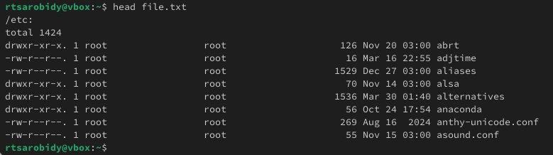{#fig:002 width=70%}

## 1. Запишите в файл file.txt названия файлов, содержащихся в каталоге /etc и домашнем каталоге

Добавляю в этот же файл названия файлов, содержащихся в вашем домашнем каталоге, используя перенапрвление >> в режиме добавления(рис.3)

{#fig:003 width=70%}

## 2. Выведите имена всех файлов из file.txt, имеющих расширение .conf и запишите их в новый текстовой файл conf.txt

Я выведу имена всех файлов из file.txt, имеющих расширение .conf с помощью команду grep(рис.4)

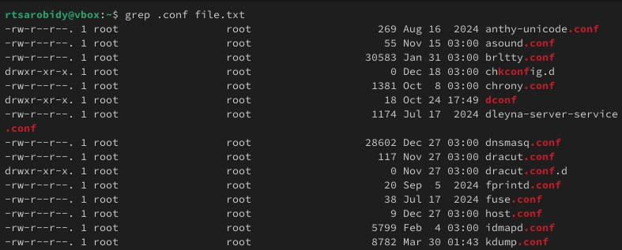{#fig:004 width=70%}

## 2. Выведите имена всех файлов из file.txt, имеющих расширение .conf и запишите их в новый текстовой файл conf.txt

Я записываю их в новый текстовой файл conf.txt с помощью перенаправление >(рис.5)

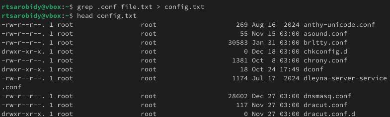{#fig:005 width=70%}

## 3. Определите, какие файлы в вашем домашнем каталоге имеют имена, начинавшиеся с символа c

Я определяю, какие файлы в домашнем каталоге имеют имена, начинавшиеся с символа "c" с помощью команду find, записываю домашний каталог в его аргументах, выбираю опции -name и записываю маса, по которой мы будем искать имя, где * - любое количество любых символов, я добавляю опции -print, чтобы получить результат(рис.6)

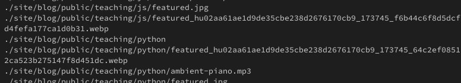{#fig:006 width=70%}

## 3. Определите, какие файлы в вашем домашнем каталоге имеют имена, начинавшиеся с символа c

Второй способ использовать команду ls -lR и использовать grep, чтобы найти элемнты с первым символом с. Однако этот способ не работает для поиска файлов из подкаталогов каталога(рис.7)

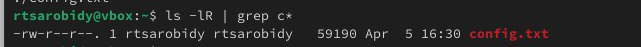{#fig:007 width=70%}

## 4. Выведите на экран имена файлов из каталога /etc, начинающиеся с символа h

Я выведу на экран имена файлов из каталога /etc, начинающиеся с символа "h" с помощью команду find(рис.8)

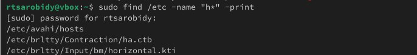{#fig:008 width=70%}

## 5. Запустите в фоновом режиме процесс, который будет записывать в файл ~/logfile файлы, имена которых начинаются с log

Я запукаю в фоновом режиме процесс(на это указывает символ &), который будет записывать в файл ~/logfile файлы, имена которых начинаются с log(рис.9)

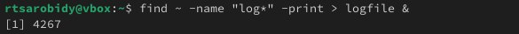{#fig:009 width=70%}

## 6. Удалите файл ~/logfile

Я удаляю файл ~/logfile(рис.10)

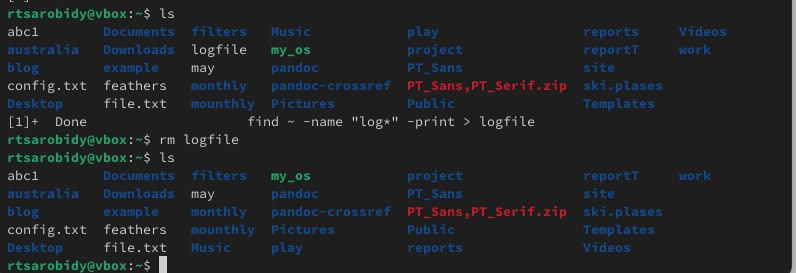{#fig:010 width=70%}

## 7. Запустите из консоли в фоновом режиме редактор geddit.

Я запускаю в консоли в фоновом режиме редактор mousepad, потому что редактора geddit у меня нет, но работают они индентично(рис.11)

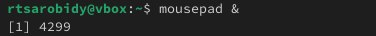{#fig:011 width=70%} 

## 8. Определите идентификатор процесса geddit, используя команду ps, конвейер и фильтр grep

Я определяю идентификатор процесса mousepad, испоьзуя команду ps, его значение 4264. Также мы можем определить идентификатор с помощью pgrep(рис.12)

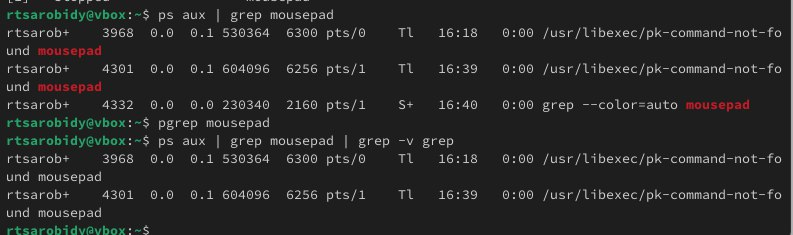{#fig:012 width=55%}

## 9. Прочтите справку команды kill и используйте её для завершения процесса gedit

Прочитаю справку (man) команды kill(рис.13)

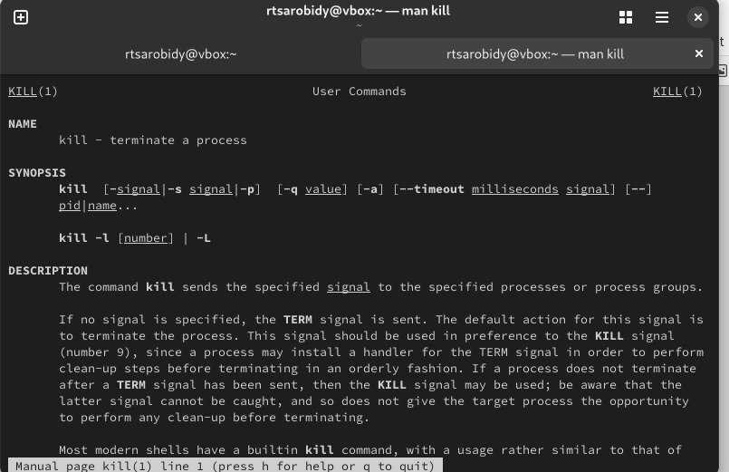{#fig:013 width=70%}

## 9. Прочтите справку команды kill и используйте её для завершения процесса gedit

Я использую команд kill и идентификатор процесса для завершения процесса mousepad(рис.14)

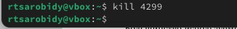{#fig:014 width=70%}

## 10. Выполните команды df и du, предварительно получив более подробную информацию об этих командах, с помощью команды man

Я прочитаю документацию про функции df и du(рис.15)

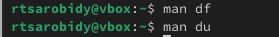{#fig:015 width=70%}

## 10. Выполните команды df и du, предварительно получив более подробную информацию об этих командах, с помощью команды man

Я использую команду df опции -iv позволяют увидеть информацию об инодах и сделать вывод читаемым, игнорируя сообщения системы о нем. Этот команд нам нужен, чтобы выяснить, сколько свободного места есть у нашей системы(рис.16)

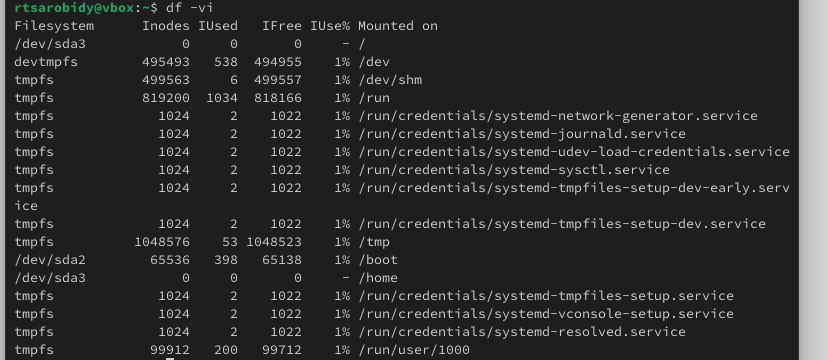{#fig:016 width=70%}

## 10. Выполните команды df и du, предварительно получив более подробную информацию об этих командах, с помощью команды man

Я использую команд du. Он нужен чтобы просмотреть, сколько места занимают файлы в определенной директории и найти самые большие из них(рис.17)

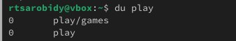{#fig:017 width=70%}

## 11. Воспользовавшись справкой команды find, выведите имена всех директорий в вашем домашнем каталоге

Я прочитаю документацию о команде find(рис.18)

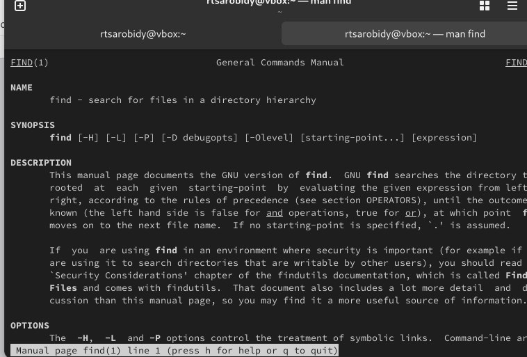{#fig:018 width=55%}

## 11. Воспользовавшись справкой команды find, выведите имена всех директорий в вашем домашнем каталоге

Я выведу имена всех директорий, имеющихся в моем домашнем каталоге, используя аргумент d у команду find, опции -type, то есть указываю тип файлов, который мне нужен и этот тип директория(рис.19)

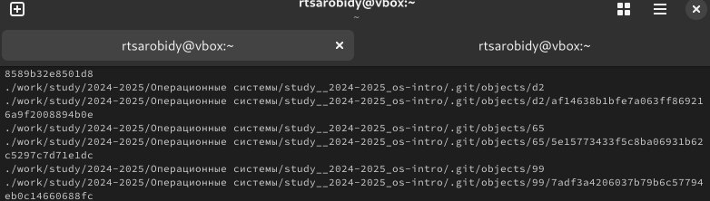{#fig:019 width=55%}

## Выводы

Выполняя эту лаборатоную работу ознакомилась с инструментами поиска файлов и фильтрации текстовых данных.А также приобрела практических навыков: по управлению процессами (и заданиями), по проверке использования диска и обслуживанию файловых систем

