---
## Front matter
title: "Отчет по лабораторной работе No8"
subtitle: "Операционные системы"
author: "Ракутуманандзара Цантамписедрана Сарубиди"

## Generic otions
lang: ru-RU
toc-title: "Содержание"

## Bibliography
bibliography: bib/cite.bib
csl: pandoc/csl/gost-r-7-0-5-2008-numeric.csl

## Pdf output format
toc: true # Table of contents
toc-depth: 2
lof: true # List of figures
lot: true # List of tables
fontsize: 12pt
linestretch: 1.5
papersize: a4
documentclass: scrreprt
## I18n polyglossia
polyglossia-lang:
  name: russian
  options:
	- spelling=modern
	- babelshorthands=true
polyglossia-otherlangs:
  name: english
## I18n babel
babel-lang: russian
babel-otherlangs: english
## Fonts
mainfont: PT Serif
romanfont: PT Serif
sansfont: PT Sans
monofont: PT Mono
mainfontoptions: Ligatures=TeX
romanfontoptions: Ligatures=TeX
sansfontoptions: Ligatures=TeX,Scale=MatchLowercase
monofontoptions: Scale=MatchLowercase,Scale=0.9
## Biblatex
biblatex: true
biblio-style: "gost-numeric"
biblatexoptions:
  - parentracker=true
  - backend=biber
  - hyperref=auto
  - language=auto
  - autolang=other*
  - citestyle=gost-numeric
## Pandoc-crossref LaTeX customization
figureTitle: "Рис."
tableTitle: "Таблица"
listingTitle: "Листинг"
lofTitle: "Список иллюстраций"
lotTitle: "Список таблиц"
lolTitle: "Листинги"
## Misc options
indent: true
header-includes:
  - \usepackage{indentfirst}
  - \usepackage{float} # keep figures where there are in the text
  - \floatplacement{figure}{H} # keep figures where there are in the text
---

# Цель работы

Ознакомление с инструментами поиска файлов и фильтрации текстовых данных. Приобретение практических навыков: по управлению процессами (и заданиями), по проверке использования диска и обслуживанию файловых систем

# Задание

1. Запишите в файл file.txt названия файлов, содержащихся в каталоге /etc и домашнем каталоге

2. Выведите имена всех файлов из file.txt, имеющих расширение .conf и запишите их в новый текстовой файл conf.txt

3. Определите, какие файлы в вашем домашнем каталоге имеют имена, начинавшиеся с символа c 

4. Выведите на экран имена файлов из каталога /etc, начинающиеся с символа h

5. Запустите в фоновом режиме процесс, который будет записывать в файл ~/logfile файлы, имена которых начинаются с log

6. Удалите файл ~/logfile

7. Запустите из консоли в фоновом режиме редактор geddit.

8. Определите идентификатор процесса geddit, используя команду ps, конвейер и фильтр grep

9. Прочтите справку команды kill и используйте её для завершения процесса gedit

10. Выполните команды df и du, предварительно получив более подробную информацию об этих командах, с помощью команды man

11. Воспользовавшись справкой команды find, выведите имена всех директорий в вашем домашнем каталоге

12. Контрольные вопросы

# Выполнение лабораторной работы

**1. Запишите в файл file.txt названия файлов, содержащихся в каталоге /etc и домашнем каталоге**

Я вошла в систему под соответсвующим именем пользователя, открыла терминал. Я записываю в файл file.txt названия файлов, содержащихся в каталоге /etc с помощью перенаправлениея >(рис.1)

{#fig:001 width=70%}

Я провеляю, что в файл записались нужные значения с помощью команду head(рис.2)

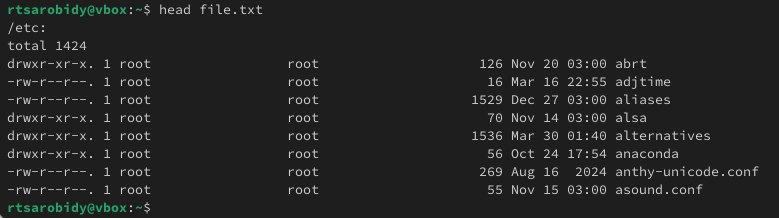{#fig:002 width=70%}

Добавляю в этот же файл названия файлов, содержащихся в вашем домашнем каталоге, используя перенапрвление >> в режиме добавления(рис.3)

{#fig:003 width=70%}

**2. Выведите имена всех файлов из file.txt, имеющих расширение .conf и запишите их в новый текстовой файл conf.txt**

Я выведу имена всех файлов из file.txt, имеющих расширение .conf с помощью команду grep(рис.4)

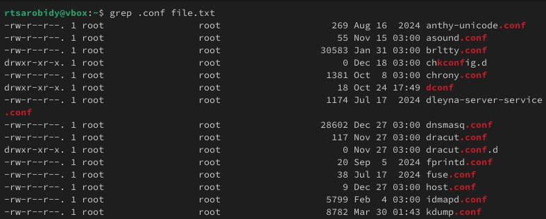{#fig:004 width=70%}

Я записываю их в новый текстовой файл conf.txt с помощью перенаправление >(рис.5)

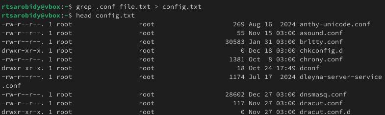{#fig:005 width=70%}

**3. Определите, какие файлы в вашем домашнем каталоге имеют имена, начинавшиеся с символа c**

Я определяю, какие файлы в домашнем каталоге имеют имена, начинавшиеся с символа "c" с помощью команду find, записываю домашний каталог в его аргументах, выбираю опции -name и записываю маса, по которой мы будем искать имя, где * - любое количество любых символов, я добавляю опции -print, чтобы получить результат(рис.6)

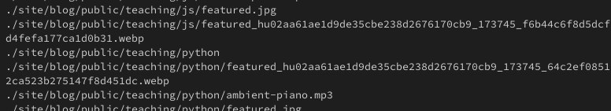{#fig:005 width=70%}

Второй способ использовать команду ls -lR и использовать grep, чтобы найти элемнты с первым символом с. Однако этот способ не работает для поиска файлов из подкаталогов каталога(рис.7)

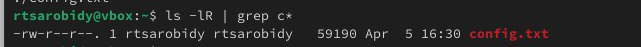{#fig:005 width=70%}

**4. Выведите на экран имена файлов из каталога /etc, начинающиеся с символа h**

Я выведу на экран имена файлов из каталога /etc, начинающиеся с символа "h" с помощью команду find(рис.8)

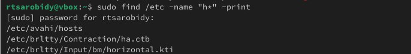{#fig:005 width=70%}

**5. Запустите в фоновом режиме процесс, который будет записывать в файл ~/logfile файлы, имена которых начинаются с log**

Я запукаю в фоновом режиме процесс(на это указывает символ &), который будет записывать в файл ~/logfile файлы, имена которых начинаются с log(рис.9)

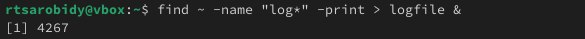{#fig:005 width=70%}

**6. Удалите файл ~/logfile**

Я удаляю файл ~/logfile(рис.10)

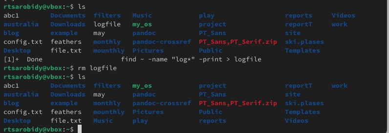{#fig:005 width=70%}

**7. Запустите из консоли в фоновом режиме редактор geddit.**

Я запускаю в консоли в фоновом режиме редактор mousepad, потому что редактора geddit у меня нет, но работают они индентично(рис.11)

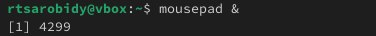{#fig:005 width=70%} 

**8. Определите идентификатор процесса geddit, используя команду ps, конвейер и фильтр grep**

Я определяю идентификатор процесса mousepad, испоьзуя команду ps, его значение 4264. Также мы можем определить идентификатор с помощью pgrep(рис.12)

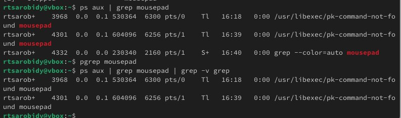{#fig:005 width=70%}

**9. Прочтите справку команды kill и используйте её для завершения процесса gedit**

Прочитаю справку (man) команды kill(рис.13)

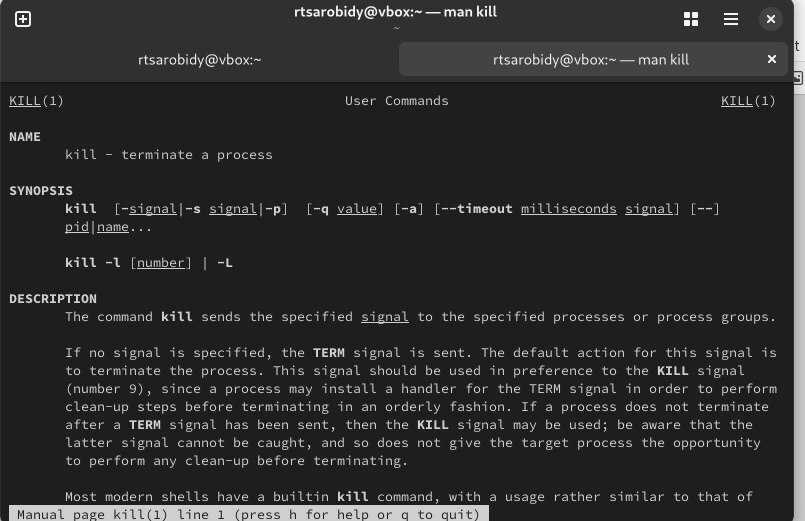{#fig:005 width=70%}

Я использую команд kill и идентификатор процесса для завершения процесса mousepad(рис.14)

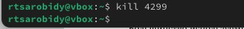{#fig:005 width=70%}

**10. Выполните команды df и du, предварительно получив более подробную информацию об этих командах, с помощью команды man**

Я прочитаю документацию про функции df и du(рис.15)

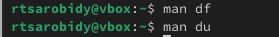{#fig:005 width=70%}

Я использую команду df опции -iv позволяют увидеть информацию об инодах и сделать вывод читаемым, игнорируя сообщения системы о нем. Этот команд нам нужен, чтобы выяснить, сколько свободного места есть у нашей системы(рис.16)

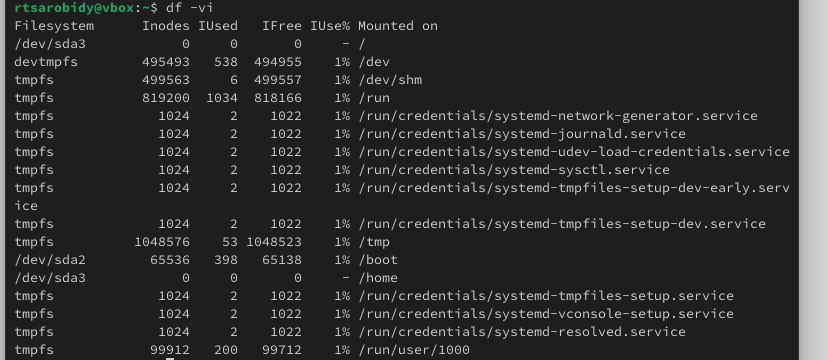{#fig:005 width=70%}

Я использую команд du. Он нужен чтобы просмотреть, сколько места занимают файлы в определенной директории и найти самые большие из них(рис.17)

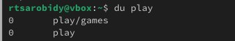{#fig:005 width=70%}

**11. Воспользовавшись справкой команды find, выведите имена всех директорий в вашем домашнем каталоге**

Я прочитаю документацию о команде find(рис.18)

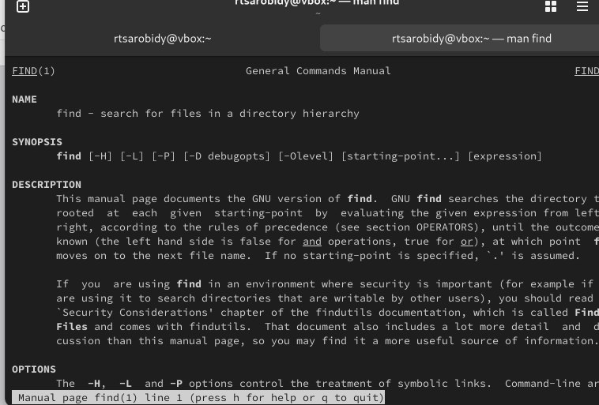{#fig:005 width=70%}

Я выведу имена всех директорий, имеющихся в моем домашнем каталоге, используя аргумент d у команду find, опции -type, то есть указываю тип файлов, который мне нужен и этот тип директория(рис.19)

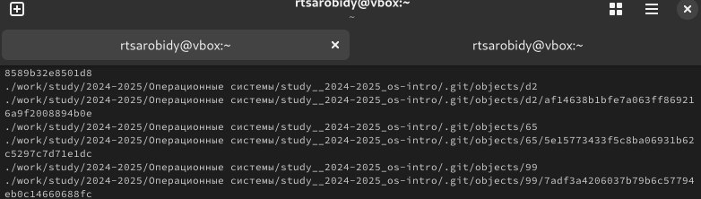{#fig:005 width=70%}

**12. Контрольные вопросы**

1. В системе по умолчанию открыто три специальных потока: – stdin — стандартный поток ввода (по умолчанию: клавиатура), файловый дескриптор 0; – stdout — стандартный поток вывода (по умолчанию: консоль), файловый дескриптор 1; – stderr — стандартный поток вывод сообщений об ошибках (по умолчанию: консоль), файловый дескриптор 2

2. Этот знак > - перенаправление ввода/вывода, а >> - перенаправление в режиме добавления

3. Конвейер (pipe) служит для объединения простых команд или утилит в цепочки, в которых результат работы предыдущей команды передаётся последующей

4. Главное отличие между программой и процессом заключается в том, что программа
- это набор инструкций, который позволяет ЦПУ выполнять определенную задачу, в то время как процесс - это исполняемая программа.

5. PPID -(parent process ID) идентификатор родительского процесса. Процесс может порождать и другие процессы. UID, GID - реальные идентификаторы пользователя и его группы, запустившего данный процесс.

6. Запущенные фоном программы называются задачами (jobs). Ими можно управлять с помощью команды jobs, которая выводит список запущенных в данный момент задач.

7. Команда htop похожа на команду top по выполняемой функции: они обе показывают
информацию о процессах в реальном времени, выводят данные о потреблении системных ресурсов и позволяют искать, останавливать и управлять процессами. У обеих команд есть свои преимущества. Например, в программе htop реализован очень удобный поиск по процессам, а также их фильтрация. В команде top это не так удобно — нужно знать кнопку для вывода функции поиска. Зато в top можно разделять область окна и выводить информацию о процессах в соответствии с разными настройками. В целом top намного более гибкая в настройке отображения процессов.

8. Команда find - это одна из наиболее важных и часто используемых утилит системы Linux. Это команда для поиска файлов и каталогов на основе специальных условий. Ее можно использовать в различных обстоятельствах, например, для поиска файлов по разрешениям, владельцам, группам, типу, размеру и другим подобным критериям.Утилита find предустановлена по умолчанию во всех Linux дистрибутивах, поэтому вам не нужно будет устанавливать никаких дополнительных пакетов. Это очень важная находка для тех, кто хочет использовать командную строку наиболее эффективно.Команда find имеет такой синтаксис: find [папка] [параметры] критерий шаблон [действие] Пример: find /etc -name “p*” -print

9. find /-type f -exec grep -H ‘текстДляПоиска’ {} ;

10. С помощью команды df -h.

11. С помощью команды du -s

12. С помощью команды kill% номер задачи

# Выводы

Выполняя эту лаборатоную работу ознакомилась с инструментами поиска файлов и фильтрации текстовых данных.А также приобрела практических навыков: по управлению процессами (и заданиями), по проверке использования диска и обслуживанию файловых систем

# Список литературы{.unnumbered}

Лабораторная работа No8
